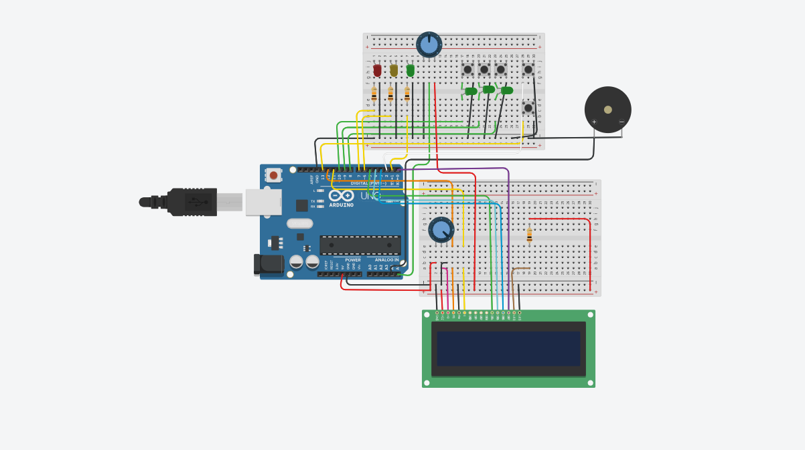

# 🔐 Cofre Eletrônico com Arduino

## 📌 Descrição do Projeto

Este projeto consiste em um **cofre eletrônico desenvolvido com Arduino Uno**, utilizando botões, LEDs, buzzer, display LCD 16x2 e potenciômetro para simular um sistema de segurança com múltiplas etapas de validação.

O sistema funciona como um cofre digital simples. Inicialmente, ele permanece travado. Para tentar abrir o cofre, o usuário precisa iniciar o sistema, digitar uma senha correta por meio dos botões e também ajustar o potenciômetro para a posição esperada.

Além disso, o projeto possui um **botão de emergência**, que trava o sistema imediatamente e emite um alerta sonoro.

---

## 🖼️ Imagem do Circuito

A imagem abaixo mostra a montagem do circuito no simulador Tinkercad:



---

## 🎯 Objetivo

O objetivo do projeto é simular o funcionamento de um cofre eletrônico com autenticação por senha e validação adicional por potenciômetro.

Com esse projeto, foi possível aplicar conceitos importantes de sistemas embarcados e programação com Arduino, como:

- Entrada digital com botões;
- Saída digital com LEDs;
- Uso de display LCD 16x2;
- Uso de buzzer para alertas sonoros;
- Leitura analógica com potenciômetro;
- Interrupção externa com botão de emergência;
- Controle de estados do sistema;
- Validação de senha por sequência numérica.

---

## 🧰 Componentes Utilizados

| Identificação | Quantidade | Componente |
|---|---:|---|
| U1 | 1 | Arduino Uno R3 |
| U2 | 1 | Display LCD 16x2 |
| D1 | 1 | LED vermelho |
| D3 | 1 | LED amarelo |
| D2, D4, D5, D6 | 4 | LEDs verdes |
| R1, R2, R3, R5 | 4 | Resistores de 10 kΩ |
| Rpot1 | 1 | Potenciômetro de 250 kΩ |
| Rpot2 | 1 | Potenciômetro de 10 kΩ |
| S1, S2, S3, S4, S5 | 5 | Botões |
| PIEZO1 | 1 | Piezo / Buzzer |
| — | 2 | Protoboards |
| — | Diversos | Jumpers |

---

## 🔎 Função dos Componentes

### 🔵 Arduino Uno R3

O Arduino é o componente principal do projeto. Ele é responsável por ler os botões, verificar a senha, analisar o valor do potenciômetro e controlar os LEDs, o buzzer e o display LCD.

### 🔴 LED vermelho

Indica que o cofre está travado, que houve erro na senha ou que o sistema está em modo de emergência.

### 🟡 LED amarelo

Indica que o sistema está aguardando a digitação da senha.

### 🟢 LEDs verdes

Indicam estados visuais do sistema, principalmente quando o cofre é liberado ou quando partes do circuito estão ativas.

### 🔘 Botões

Os botões são utilizados para:

- Digitar os números da senha;
- Confirmar a tentativa de abertura;
- Acionar o modo de emergência.

### 📟 Display LCD 16x2

O LCD exibe mensagens para orientar o usuário durante o funcionamento do sistema, como:

- `Digite a senha:`
- `Cofre Aberto!`
- `Senha Incorreta!`
- `Posicao Invalida`
- `EMERGENCIA!`

### 🎚️ Potenciômetro

O potenciômetro funciona como uma segunda etapa de segurança. Mesmo que a senha esteja correta, o cofre só abre se o potenciômetro estiver dentro da faixa esperada.

### 🔊 Buzzer / Piezo

O buzzer emite sons diferentes para indicar:

- Sucesso na abertura do cofre;
- Erro na senha ou na posição do potenciômetro;
- Alerta de emergência.

---

## ⚙️ Funcionamento do Sistema

## 1. Estado Inicial 🔒

Quando o sistema é ligado, o cofre começa travado.

Nesse estado:

- O LED vermelho fica aceso;
- O LED amarelo fica apagado;
- O LED verde fica apagado;
- O sistema aguarda o botão de início ser pressionado.

---

## 2. Início da Digitação 🔢

Para iniciar a tentativa de abertura, o usuário deve pressionar o botão de confirmação, chamado no código de botão `Zezin`.

Após isso:

- O LED vermelho apaga;
- O LED amarelo acende;
- O LCD exibe a mensagem:

```txt
Digite a senha:
```

---

## 3. Digitação da Senha 🔐

A senha é formada por uma sequência de três números.

No código, a senha correta definida é:

```cpp
const int sequenciaCorreta[3] = {3, 1, 2};
```

Ou seja, a sequência correta é:

```txt
3 - 1 - 2
```

A cada botão pressionado, o sistema registra o número digitado e exibe um asterisco `*` no LCD, simulando o comportamento de uma senha real.

Exemplo:

```txt
Digite a senha:
***
```

---

## 4. Confirmação da Senha ✅

Depois de digitar os três números, o usuário deve pressionar novamente o botão de confirmação.

Se os três dígitos ainda não tiverem sido digitados, o LCD exibe:

```txt
Faltam digitos!
```

Se os três dígitos foram digitados, o sistema compara a senha informada com a senha correta.

---

## 5. Validação com Potenciômetro 🎚️

Além da senha correta, o potenciômetro precisa estar na posição adequada.

No código, o valor do potenciômetro é lido pela entrada analógica:

```cpp
int valorPotenciometro = analogRead(pinoPotenciometro);
```

A faixa considerada correta é:

```txt
450 até 550
```

Isso significa que o cofre só abre se:

- A senha estiver correta;
- O potenciômetro estiver aproximadamente no meio da escala.

---

## 6. Cofre Aberto 🟢

Se a senha estiver correta e o potenciômetro estiver na posição correta, o sistema libera o cofre.

Nesse caso:

- O LED verde acende;
- O LCD exibe:

```txt
Cofre Aberto!
```

- O buzzer emite um som de sucesso.

Trecho do código responsável pela abertura:

```cpp
if (senhaCorreta && posicaoCorreta) {
  digitalWrite(ledVerde, HIGH);
  lcd.print("Cofre Aberto!");
  tone(pinoBuzzer, 1000, 500);
}
```

Após alguns segundos, o sistema retorna ao estado inicial e o cofre volta a ficar travado.

---

## 7. Senha Incorreta ❌

Se a senha digitada estiver incorreta, o cofre não abre.

Nesse caso:

- O LED vermelho acende;
- O LCD exibe:

```txt
Senha Incorreta!
```

- O buzzer emite um som de erro;
- O sistema retorna ao estado inicial.

---

## 8. Posição Inválida do Potenciômetro ⚠️

Se a senha estiver correta, mas o potenciômetro estiver fora da faixa esperada, o cofre também não abre.

Nesse caso, o LCD exibe:

```txt
Posicao Invalida
```

Isso representa uma segunda camada de segurança no sistema.

---

## 🚨 Botão de Emergência

O projeto possui um botão de emergência conectado ao pino 2 do Arduino.

Esse botão utiliza interrupção externa por meio da função:

```cpp
attachInterrupt(digitalPinToInterrupt(pinoEmergencia), ativarEmergencia, FALLING);
```

Quando o botão de emergência é pressionado:

- O sistema interrompe a tentativa atual;
- A senha digitada é apagada;
- O LED vermelho acende;
- O LED amarelo e o LED verde apagam;
- O buzzer emite um som de alarme;
- O LCD exibe:

```txt
EMERGENCIA!
SISTEMA TRAVADO
```

Depois de alguns segundos, o sistema volta ao estado inicial.

---

## 🧠 Lógica Principal do Projeto

O projeto trabalha com dois estados principais:

| Estado | Descrição |
|---|---|
| Sistema travado | Aguarda o botão de início ser pressionado |
| Aguardando senha | Permite digitar a sequência de três números |

A variável responsável por controlar esse estado é:

```cpp
bool aguardandoSenha = false;
```

Quando o usuário pressiona o botão de início, essa variável passa a valer `true`, permitindo a digitação da senha.

---

## 🔌 Pinos Utilizados

| Componente | Pino |
|---|---:|
| Botão 1 | 10 |
| Botão 2 | 9 |
| Botão 3 | 8 |
| Botão de confirmação | 13 |
| Botão de emergência | 2 |
| LED vermelho | 7 |
| LED amarelo | 6 |
| LED verde | 1 |
| Buzzer | A4 |
| Potenciômetro | A5 |
| LCD RS | 12 |
| LCD EN | 11 |
| LCD D4 | 5 |
| LCD D5 | 4 |
| LCD D6 | 3 |
| LCD D7 | 0 |

---

## 📚 Biblioteca Utilizada

O projeto utiliza a biblioteca `LiquidCrystal`, responsável pelo controle do display LCD 16x2.

```cpp
#include <LiquidCrystal.h>
```

Essa biblioteca permite configurar os pinos do LCD e escrever mensagens na tela.

---

## ▶️ Como Executar o Projeto

Para executar o projeto, siga os passos abaixo:

1. Monte o circuito conforme a imagem e os pinos definidos no código.
2. Conecte o Arduino ao computador.
3. Abra o código na IDE do Arduino.
4. Selecione a placa `Arduino Uno`.
5. Selecione a porta correta.
6. Faça o upload do código.
7. Pressione o botão de início.
8. Digite a senha usando os botões.
9. Ajuste o potenciômetro para a posição correta.
10. Pressione novamente o botão de confirmação.
11. Verifique no LCD se o cofre foi aberto ou se houve erro.

---


## 🧪 Testes Realizados

Durante o desenvolvimento, foram testadas as seguintes situações:

| Teste | Resultado Esperado |
|---|---|
| Senha correta e potenciômetro correto | Cofre abre |
| Senha incorreta | Cofre permanece travado |
| Senha correta e potenciômetro incorreto | Cofre permanece travado |
| Menos de 3 dígitos digitados | LCD exibe aviso |
| Botão de emergência pressionado | Sistema trava imediatamente |
| Reinício após tentativa | Sistema volta ao estado inicial |

---


## ✅ Conclusão

O projeto simula um sistema de segurança simples, utilizando senha, potenciômetro e botão de emergência para controlar a abertura do cofre. Com isso, foi possível entender melhor como diferentes componentes, como botões, LEDs, buzzer e display LCD, podem trabalhar juntos para formar uma solução interativa e funcional.


## Autoras
Ester Pereira dos Santos Nascimento    
Luana de Almeida Ferreira

